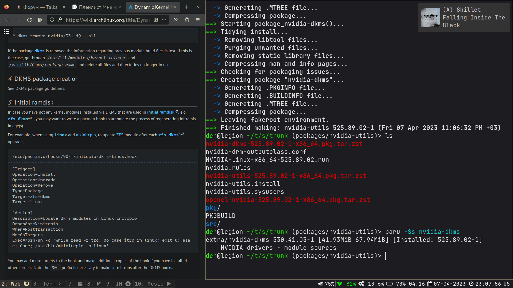

## My personal dotfiles

### Includes configuration for:

* [i3wm + i3bar](../.config/i3) + [i3status](../.config/i3status)
* [dunst](../.config/dunst)
* [kitty](../.config/kitty) + [fish shell](../.config/fish)
* [neovim](../.config/nvim)
* [vifm](../.config/vifm)
* IDEA + [ideavim](../.ideavimrc)

### Also includes: 

* [Wallpapers](../pics)
* [Custom shell scripts](../exe)

### Links

* [RU] [Пост на Linux.org.ru о тяжелых буднях арчевода](https://www.linux.org.ru/gallery/screenshots/17187470)

